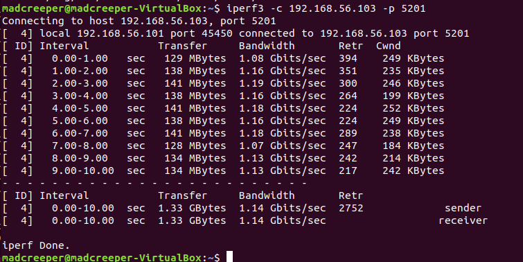

# Lab 4: Overlay Network and VXLAN
##### 孙济宸 520030910016
### VXLAN setup
On VM 1:
In mininet, set the IPs for both hosts:
```
h1 ifconfig h1-eth0 10.0.0.1 netmask 255.0.0.0
h2 ifconfig h2-eth0 10.0.0.2 netmask 255.0.0.0
```
Open another terminal, set the switch IP:
```
sudo ifconfig s1 10.0.0.5/8 up
```
On VM 2:

In mininet, set the IPs for both hosts:
```
h3 ifconfig h3-eth0 10.0.0.3 netmask 255.0.0.0
h4 ifconfig h4-eth0 10.0.0.4 netmask 255.0.0.0
```
Open another terminal, set the switch IP:
```
sudo ifconfig s2 10.0.0.6/8 up
```
When we ping 10.0.0.6/10.0.0.3/10.0.0.4 from 10.0.0.5/10.0.0.1/10.0.0.2, it returns 'unreachable'.

On VM1:
```
sudo ovs-vsctl add-br br1
```
Assign the IP of ens34 to br1：
```
sudo ovs-vsctl add-port br1 ens34
sudo ifconfig br1 192.168.56.101/24 up
```
Add a new default route for br1:
```
sudo route add default gw 192.168.56.201
```

On VM2:
```
sudo ovs-vsctl add-br br1
```
Assign the IP of ens34 to br1:
```
sudo ovs-vsctl add-port br1 ens34
sudo ifconfig br1 192.168.56.103/24 up
```
Add a new default route for br1:
```
sudo route add default gw 192.168.56.201
```

Now we create the VXLAN tunnel.

On VM1:
```
sudo ovs-vsctl add-port s1 vxlan1 -- set interface vxlan1 type=vxlan options:remote_ip=192.168.56.103
```

On VM2:
```
sudo ovs-vsctl add-port s2 vxlan1 -- set interface vxlan1 type=vxlan options:remote_ip=192.168.56.101
```

### Testing
After this we we can test ping and the network works.

  


Using *Wireshark*, we can see that the ping command uses these protocols below:
  

  

- ICMP: Mainly used by the ping command, namely ICMP echo request and reply. 
-  IPv4. The network layer protocol used in this lab.
-  ARP. This is used to resolve the MAC address given an IP address. We can see in the screenshot that a host (s1) asks for the MAC address of 10.0.0.6 and gets a response.
- Ethernet: the data link layer protocol used by Mininet.

Before we use *iperf* to test the bandwidth, we need to change the MTU of the hosts:
  
  

This is because VXLAN adds a 50 Byte header to a data link layer segment. In order for iperf to work on a standard mtu of 1500, we need to reduce the host ethernet interface mtu.

The bandwidth between s1 and s2 is an unlimited 1Gbps.
  

The bandwidth between h1/h2 and h3/h4 is limited by the 10Mbps links.
  

*ping* tells a similar story. Since each hop is 5ms except for between s1 and s2, the rtt is around 20-30 ms between h1/h2 and h3/h4, and < 1ms between s1 and s2. 
  

  
